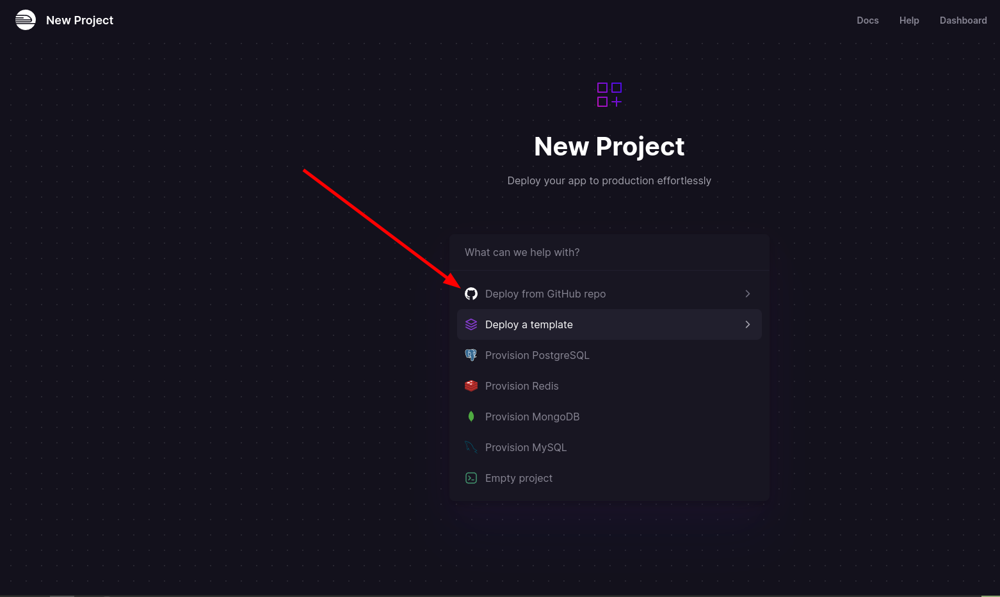
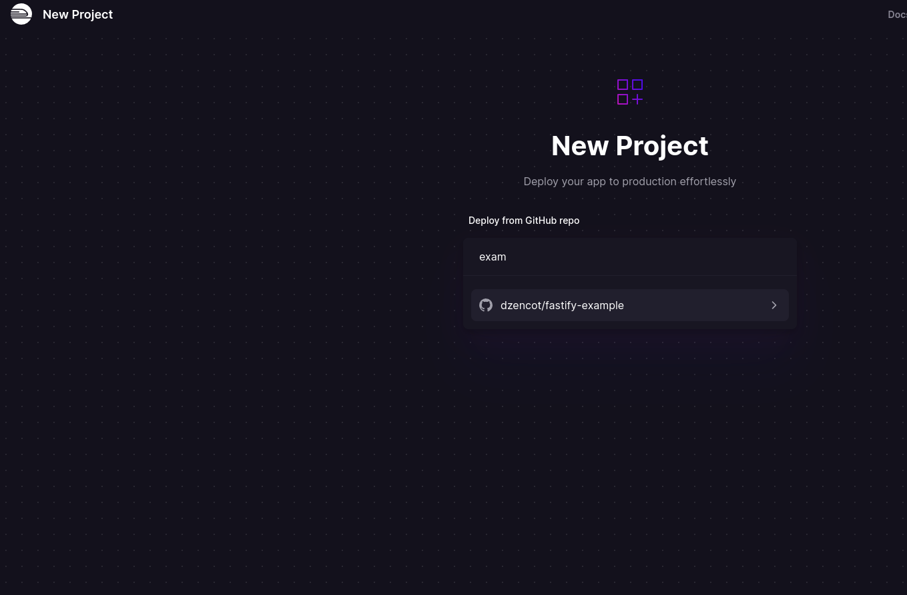
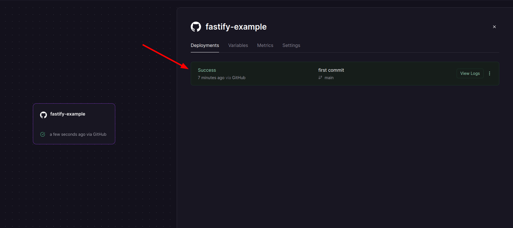
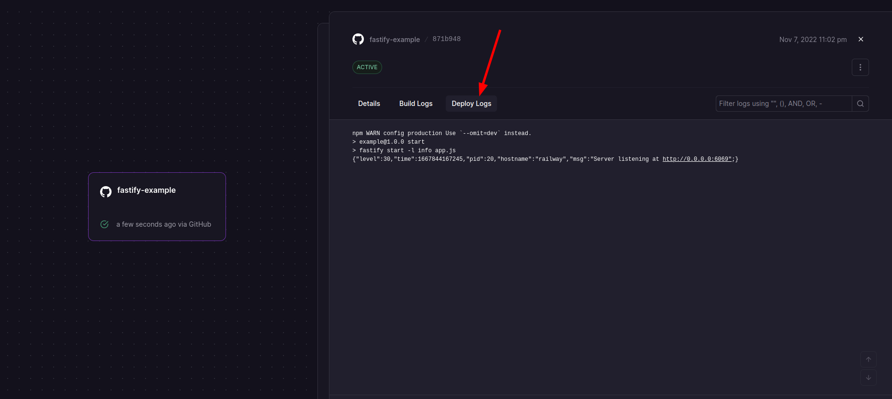
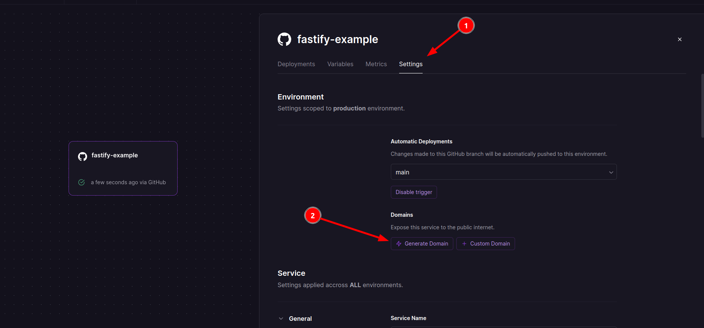
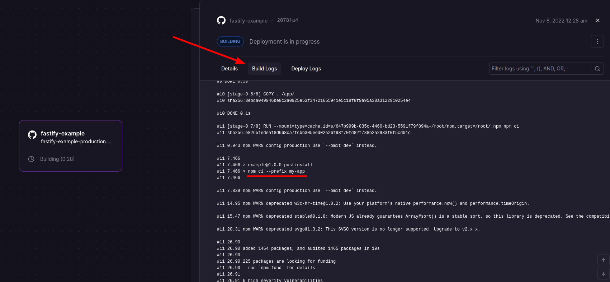

# Гайд по деплою приложения на railway

В этом гайде вы научитесь деплоить приложение nodejs на https://railway.app. У вас должен быть аккаунт на этом сервисе и на гитхабе. Гайд предполагает, что вы умеете работать с гитом и имеете представление работы на nodejs.

Гайд будет полезен бэкенд- и фронтенд-разработчикам

В процессе мы создадим небольшое hello-world приложение. Весь код [находится здесь](https://github.com/dzencot/fastify-example).

### Создание приложения

В качестве примера создадим приложение на фреймворке [fastify](https://www.fastify.io). Если вы фронтенд-разработчик и не собираетесь делать бэкенд-приложение, не расстраивайтесь. Я расскажу далее как подключить SPA-приложение на реакте и настроить деплой. Просто следуйте инструкциям.

Для создания приложения на `fastify` используйте команду:

```shell
npm init fastify
```

Если утилита запрашивает установку дополнительных пакетов, согласитесь (введите `y`)


Утилита сгенерирует файлы. После этого установите зависимости:

```shell
npm install
```

Проверьте что приложение работает. Для этого запустите его:

```shell
npm start
```

И перейдите по адресу сервера. Приложение подсказывает адрес:


Теперь все готово для деплоя на railway.

### Первый деплой

Есть несколько способов деплоя: с помощью cli-утилиты и через гитхаб. Здесь будет описываться второй способ.

Создайте репозиторий на гитхабе и запушьте приложение

Затем зайдите в свой аккаунт на [https://railway.app](https://railway.app) и нажмите "Start a New Project", далее выберите "Deploy from Github repo"



Выберите нужный репозиторий с приложением, можно воспользоваться поиском



И нажмите "Deploy now". Через некоторое время приложение соберется и запустится, а в окне появится успешный деплой



Нажмите на него и затем нажмите "Deploy logs", вы должны увидеть логи работы приложения



Приложение работает, но еще не доступно для внешнего мира. Нужно его привязать к определенному адресу.

Закройте окно деплоя и вернитесь в проект, зайдите в настройки (1) и нажмите "Generate Domain" (2)



После некоторого времени появится адрес, перейдите по нему, дождитесь когда приложение запустится и выведет результат: `{"root":true}`.

Поздравляю, проект задеплоен и уже можно звать гостей!

### Деплой React-приложения

Теперь немного усложним проект, добавим в него SPA-приложение на реакте. Для этого в директории проекта выполните команду:

```shell
npx create-react-app my-app
```

Она создаст приложение на реакте в директории `my-app` в корне нашего проекта. Имя приложения `my-app` можете заменить на любое другое. 

Проверьте, что приложение работает. Для этого перейдите в директорию и запустите реакт-приложение:

```shell
npm start
```

После старта откроется страница в браузере с адресом приложения (по умолчанию [http://localhost:3000](http://localhost:3000)). Проверьте, что вы остановили fastify-проект, который мы создали ранее, чтобы он не занимал порт. Вы должны увидеть логотип реакта.

Приложение на реакте имеет особенность: его нужно собирать. Команда `npm start` запускает вебпак сервер, который предназначен для разработки, но не для полноценной работы. Об этом пишет само приложение после запуска:


Чтобы собрать приложение, выполните команду сборки в директории `my-app`:

```shell
npm run build
```

После этого появится директория **build** — это и есть наше собранное реакт-приложение, подготовленное для работы на проде.

Билд не включает в себя вебпак-сервер, поэтому нам нужен какой-то другой сервер, который будет предоставлять клиентам веб-приложение. Этим сервером будет наше приложение на `fastify`, которое мы до этого уже создали.

Нужно немного доработать наше fastify-приложение, чтобы оно умело раздавать фронт. Перейдите в корень проекта, все команды ниже будут выполняться в этой директории

Для работы со статикой (билдом реакт-приложения) установите библиотеку:

```shell
npm i @fastify/static
```

Отредактируйте файл *app.js*. В него нужно импортировать установленную библиотеку:

```javascript
const fastifyStatic = require('@fastify/static');
```

И добавьте внутри функции подключение нашего реакт приложения:

```javascript
fastify.register(fastifyStatic, {
  root: `${process.cwd()}/my-app/build`,
});
```

Добавьте обработчик по умолчанию, чтобы он возвращал страницу html: 

```javascript
fastify.setNotFoundHandler((req, res) => {
  res.sendFile('index.html');
});
```

Это даст возможность открывать реакт-приложение при любых несуществующих роутах. Полный код файла должен получиться таким:

```javascript
'use strict'

const path = require('path')
const AutoLoad = require('@fastify/autoload')
const fastifyStatic = require('@fastify/static');

module.exports = async function (fastify, opts) {
  // Place here your custom code!

  fastify.register(fastifyStatic, {
    root: `${process.cwd()}/my-app/build`,
  });

  fastify.setNotFoundHandler((req, res) => {
    res.sendFile('index.html');
  });

  // Do not touch the following lines

  // This loads all plugins defined in plugins
  // those should be support plugins that are reused
  // through your application
  fastify.register(AutoLoad, {
    dir: path.join(__dirname, 'plugins'),
    options: Object.assign({}, opts)
  });

  // This loads all plugins defined in routes
  // define your routes in one of these
  fastify.register(AutoLoad, {
    dir: path.join(__dirname, 'routes'),
    options: Object.assign({}, opts)
  });
}
```

Код написан с использованием commonJS-модулей. Можете переделать на ES-модули или оставить как есть. Не переживайте, если что-то в коде не понятно. Основная работа позади.

Проверьте, что приложение на реакте остановлено — оно может занимать порт. Запустите приложение fastify и откройте его в браузере, добавив к адресу любой путь, например [http://localhost:3000/somepath](http://localhost:3000/somepath). Если вы видите приложение на реакте, то все получилось.

Запушьте изменения в гитхаб. На railway начнется автоматическая сборка приложения.

Перейдите в проект на railway и проверьте работу. Приложение работает, но страница реакта недоступна. Так происходит, потому что директория **build** не попадает в репозиторий, а railway на выполняет билд. В сервисе выполняются стандартные команды для запуска приложения.
Если мы склонируем проект в новую директорию и выполним `npm ci`, а затем `npm start`, то приложение на реакте так же не будет работать. Тоже самое делает и railway. Перед запуском должно собираться реакт-приложение.

Для решения этой проблемы можно модифицировать *package.json*. Нужно добавить в него установку зависимостей реакт-приложения, для этого добавьте в секции `scripts` еще одну команду:

```
"postinstall": "npm ci --prefix my-app"`
```

Эта команда будет устанавливать зависимости в директории **my-app** при каждой установке зависимостей в корневом проекте.

Аналогично нужно добавить команду сборки фронтенд приложения:

```
"build": "npm run build --prefix my-app"
```

Либо вы можете это сделать через настройки проекта railway, не забудьте при этом нажать на галку (2):


Теперь railway будет устанавливать зависимости в my-app и делать сборку перед запуском приложения.

Запушьте изменения, проверьте работу, проверьте страницу на реакте.

Если что-то пошло не так, проверьте логи. Если вы правильно указали `postinstall`, то в логах вы должны видеть запуск установки зависимостей:




Если вы изучаете программирование и у вас на railway бесплатный аккаунт, рекомендую удалять деплой, чтобы ваше приложение не тратило ресурсы. Изначально вам доступно ограниченное количество ресурсов на сервисе. Если ваши приложения превысят лимит, то придется брать платный тариф или ждать начало нового месяца. На следующий месяц лимиты сбросятся.

Готовый проект для деплоя [находится здесь](https://github.com/dzencot/fastify-example)
